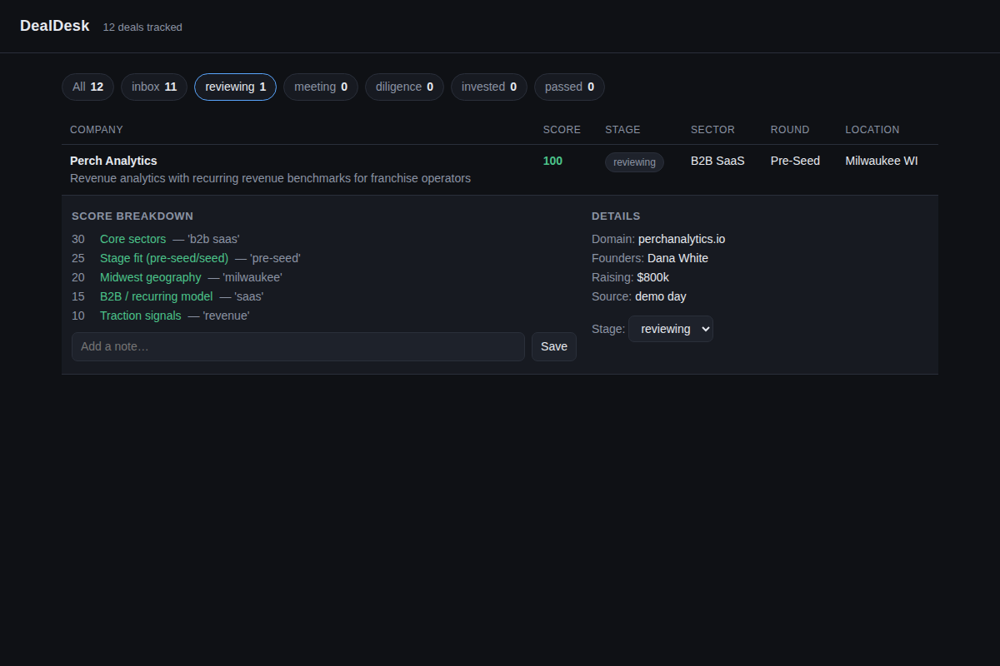

# DealDesk

**A local-first deal-flow pipeline for early-stage investing: dump in company CSVs from
anywhere, score them against your written thesis, and run your week from one dashboard.**

Built for anyone triaging startup lists — student VCs, angels, scouts, accelerator
readers. No accounts, no API keys, no pip installs. Python 3.10+ standard library only;
everything lives in one SQLite file you own.



## Run it (30-second demo)

```sh
sh demo.sh
```

That ingests two bundled sample CSVs (with different header styles — watch two duplicate
companies get merged), scores all 12 deals against a sample thesis, prints the ranked
pipeline and a weekly report, then opens the dashboard at
**http://127.0.0.1:8756**. Click any row for the score breakdown; move stages and add
notes right from the browser.

## Use it with your own data

```sh
python3 -m dealdesk ingest your_list.csv --source "demo day"   # any reasonable headers work
python3 -m dealdesk init-thesis                                 # writes thesis.json — edit it
python3 -m dealdesk score
python3 -m dealdesk list --top 10
python3 -m dealdesk show 3                                      # why did it score that way?
python3 -m dealdesk move 3 meeting --note "intro call Thursday"
python3 -m dealdesk followup 3 +1w
python3 -m dealdesk todo                                        # due follow-ups + stale deals
python3 -m dealdesk report -o weekly.md                         # markdown weekly review
python3 -m dealdesk serve                                       # the dashboard
```

The database defaults to `./dealdesk.db` (override with `--db` or `$DEALDESK_DB`).
Re-ingesting is always safe: deals are deduped by website domain, then by normalized
name, and merges only fill empty fields — your edits are never overwritten.

## Writing a thesis

`thesis.json` is a list of weighted keyword rules plus hard vetoes:

```json
{
  "name": "Midwest early-stage B2B",
  "rules": [
    {"label": "Stage fit", "field": "round", "weight": 25, "match": ["pre-seed", "seed"]},
    {"label": "Geography", "field": "location", "weight": 20, "match": ["chicago", "detroit"]}
  ],
  "vetoes": [
    {"label": "Out of scope", "field": "any", "match": ["gambling"]}
  ]
}
```

A deal's score is the matched weight as a percentage of total weight (0–100). Matching is
case-insensitive on word boundaries ("ai" matches "AI infra", not "chain"). `field` can
be any deal field or `"any"`. A veto match forces the score to 0. Every score keeps its
full per-rule explanation — nothing is a black box.

## Tests

```sh
python3 -m unittest discover -s tests    # 70 tests, all offline
```

See `VERIFICATION.md` for the full verified-behavior log and `STATUS.md` for the state
of the build.
